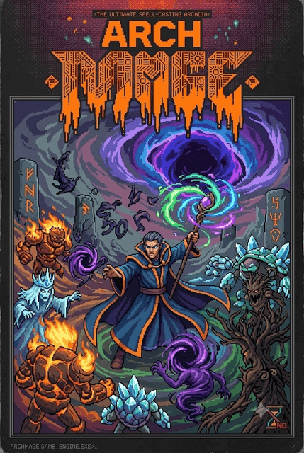

<div align="center">



# ⚔️ ARCHMAGE

### *Rift Survivor — Version 1.1 "True Direction"*

A **pure arcade roguelike** that runs entirely in the browser.
No accounts · no servers · no loading screens — every spell, resonance,
monster and note of the score is generated at runtime.

[](./CHANGELOG.md)
[](#%EF%B8%8F-tech-stack)
[](#-the-score)
[](./LICENSE)

**🜂 13 elements · 🜛 78 resonances · 👑 5 shuffled tyrants · 🌊 50 waves + endless**

</div>

---

## 🜛 The Game

You are the last Archmage. **Fifty waves** stand between you and the sealed
rift, split into five biomes of ten — each capped by a tyrant whose position
is shuffled by the seed. Clear the fiftieth and **the end-credit sequence
rolls your deeds over the frozen arena**; then the choice:

> 🌑 **RETURN** — bank the triumph.
> 🗡️ **FIGHT** — the rift reopens: the Endless Dirge, waves 51+ with
> escalating pressure and *Echo* tyrants every tenth wave, until you fall.

Everything scales, everything shuffles, and nothing interrupts the fight —
no cutscenes, no story, no filler.

| System | What it does |
| --- | --- |
| 🔥 **13 elements / 78 resonances** | Cast two different elements within 1.5 s to weave a resonance. All 78 live in the Arcanum, locked until you find them. |
| 📈 **The attunement curve** | *Your magic grows with the rift* — spell power compounds ×1.055 per wave against a softened enemy curve. Nothing is a bullet sponge; difficulty comes from pressure, not HP walls. |
| 🎯 **The weave hunts the marked** | Elite foes (Blazing / Swift / Bulwark / Leech) take **+35 % spell damage** and read gold on impact — marked prey, never walls. |
| 👑 **Tyrants that scale with the act** | Boss HP rides the same curve as your power, so every tenth-wave duel holds its hit-count wherever the shuffle places it. Five genuinely distinct minds: stampede charger, shockwave juggernaut, blade dancer, blink fortress, apex storm. |
| 💎 **Strict one-drop-per-wave** | Each wave fields **exactly one** drop type — a spell tear, a heart (25 % mend), a resonance orb, or the every-5-wave tribute gate. |
| 🎲 **Fair-cycling RNG** | Spell tears draw from a seeded **shuffle-bag**; tribute boons and transmutations draft with `1/(1+n)` recency weights so every eligible card surfaces. |
| 🜂 **The sacrifice merge** | Resonance orbs demand a tithe: sacrifice **exactly two** bound spells; they fuse into one merged slot that casts both in succession. |
| ✨ **Aether glyphs** | Foes shed glyphs — every pickup registers on the live HUD counter and pays out post-game at 25 % conversion. |
| 🏛️ **The Reliquary** | Spend glyphs on four permanent tracks — Vitality / Power / Focus / Swiftness — six levels each. |
| 📖 **The Arcanum** | Spellbook, 78-resonance codex, **first-kill bestiary**, tyrant gallery and lifetime records. |
| ⚖️ **Rift Mercy** | Opt-in per-death assist ladder (Hades-style dignity): tiers bank with every fall, clear on triumph. |
| 🧠 **The Fateweaver** | Archmage Mode autopilot: line-of-sight-disciplined casting, resonance hunting, surge discipline. Press `T` and watch a clean run. |
| ♿ **Accessibility suite** | UI size, announcement text size, reduce flashes, high-contrast HUD, screen-shake toggle, damage-number toggle, aim assist, full `prefers-reduced-motion` respect — all live, no restart. |
| 🎼 **The score** | Fully synthesized (Web Audio API) — an act-tinted drone with plucks that calms in the menu, sharpens in combat, and the instant a tyrant enters: sting → driving ostinato → tritone war-drone at half health → instant collapse on the kill. |

## 🎮 Controls

| Input | Action |
| --- | --- |
| `W A S D` | Move |
| `LMB` | Cast selected spell (aim assist curves the weave) |
| `RMB` | Arcane volley — homing bolts |
| `1 2 3` / wheel / `Q E` | Select / cycle spells |
| `Space` | Blink step (brief immunity) |
| `F` | Weave Surge (when the meter is full) |
| `T` | Archmage Mode — the rift plays itself |
| `P` / `Esc` | Pause |
| `M` | Mute |

📱 Touch devices get a **twin-thumb layer with a floating analog stick**,
hold-to-FIRE, hold-to-VOLLEY, SPELL cycle, DASH and SURGE — all with live
cooldown veils and aether-cost badges, customizable in Settings.

## ⚙️ Tech Stack

| Layer | Technology |
| --- | --- |
| **Framework** | Next.js 16 (App Router) + TypeScript 5 |
| **Styling** | Tailwind CSS 4 |
| **Game engine** | Canvas 2D (~5,600 lines): fixed-timestep simulation, dead-flag entities with in-place compaction, squared-distance hot paths, cached gradients, flow-field pathfinding |
| **HUD** | Throttled 30 Hz DOM-ref layer (no React re-render on the hot path) |
| **State** | Zustand for UI state |
| **Audio** | Web Audio API — fully synthesized, zero audio files |
| **Persistence** | localStorage — no database, no backend, no telemetry |

```
src/
  game/
    content.ts     # spells, resonances, enemies, bosses, biomes, scaling curves
    engine.ts      # the simulation: waves, casts, merges, bosses, juice
    audio.ts       # procedural synth: adaptive score + every SFX voice
    evolutions.ts  # 22 spell transmutations, filtered to equipped spells
    autopick.ts    # Fateweaver AI logic
    store.ts       # Zustand store (meta / settings / overlays)
  components/game/
    GameShell.tsx   # HUD + canvas host + overlay wiring
    screens.tsx     # menu, Reliquary, Arcanum, settings, pause, game over
    overlays.tsx    # evolution / spell offer / sacrifice merge / end credits
    TouchControls.tsx, icons.tsx, GameErrorBoundary.tsx
  lib/
    utils.ts       # cn() — clsx + tailwind-merge utility
  app/
    page.tsx        # the single route (client-only game shell)
    layout.tsx      # icons, favicons, OG/Twitter cards, web manifest
    globals.css     # the design system
scripts/
    build-brand.mjs # regenerates the whole icon/banner suite (bun run brand)
public/
    favicon.ico / favicon.svg / favicon-{16,32}.png / apple-touch-icon.png
    icon-{192,512}.png / maskable-icon.png / site.webmanifest / logo.svg
    art/  # cover.png (menu backdrop), og-image, twitter-card,
          #   banner, preview + src/ (source paintings)
```

## 🚀 Getting Started

Requires [Bun](https://bun.sh) ≥ 1.1 (or npm/node — swap the commands
accordingly).

```bash
bun install       # install dependencies
bun run dev       # dev server on http://localhost:3000
```

### Quality Gates

```bash
bun run lint        # ESLint (Next.js + TypeScript rules)
bun run typecheck   # tsc --noEmit
```

### Regenerate Brand Assets

```bash
bun run brand   # rebuilds every icon, favicon and banner from source art
```

## 🌐 Deploy to GitHub Pages

The repo ships two GitHub Actions workflows:

### CI (`.github/workflows/ci.yml`)
Runs on every push and pull request: lint → typecheck.

### Deploy (`.github/workflows/deploy.yml`)
Builds and deploys the static export to GitHub Pages:

1. Push to `main` (or run the workflow manually).
2. Repo **Settings → Pages → Source: GitHub Actions**.
3. The workflow installs, lints, type-checks, builds the static export,
   **verifies the brand suite and `.nojekyll`** landed in `out/`, and deploys —
   your game lands at `https://<user>.github.io/<repo>/`.

`public/.nojekyll` prevents Jekyll from starving the `_next/` directory.

### Manual Static Build

```bash
BUILD_MODE=pages BASE_PATH=/my-repo NEXT_PUBLIC_BASE_PATH=/my-repo \
  NEXT_PUBLIC_SITE_URL=https://user.github.io/my-repo bun run build:pages
# → static site in ./out (serve it anywhere)
```

For a user-root site (`user.github.io`) omit the base-path variables entirely.

### Self-hosting (Node / Bun)

```bash
bun run build   # standalone server build → .next/standalone
bun run start
```

## 🎼 The Score

Every sound is an oscillator — **zero audio files**. An act-tinted drone and
plucked ladder calm down in the menu and sharpen with combat intensity; boss
fights get their own three-arc theme (entry sting → enrage war-drone at half
health → collapse on the kill), all summed through a master compressor.

## 🛠️ Design Notes

- **Two source paintings, then procedural.** The menu cover and the key-art
  banners are the only committed raster art; everything else — boss sigils,
  Arcanum covers — is seeded, deterministic SVG generated at runtime.
- **The brand suite is one command.** `bun run brand` regenerates the favicon.ico,
  SVG favicon, apple-touch icon, PWA icons, web manifest, Open Graph / Twitter /
  GitHub banners and the menu cover from `public/art/src/`.
- **Matched curves, not walls.** Player power and enemy HP ride curves of the
  same family; elites trade raw HP for a damage-taken bonus; bosses anchor to
  your own growth.
- **Bosses gain attacks, never just speed.** Phase two adds a new pattern or
  arm to every tyrant — the Dead Cells rule.

## 📜 License

[MIT](./LICENSE) — fork it, mod it, ship it.
